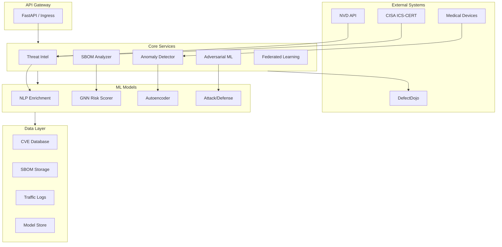

# MedTech AI Security - AI-Powered Medical Device Cybersecurity

[](https://www.python.org/downloads/)
[](https://opensource.org/licenses/MIT)
[](https://github.com/psf/black)
[](https://codecov.io/gh/Dashtid/medtech-ai-security)
[](https://github.com/Dashtid/medtech-ai-security/actions/workflows/ci.yml)
[](https://scorecard.dev/viewer/?uri=github.com/Dashtid/medtech-ai-security)
[](https://www.bestpractices.dev/projects/9999)
[](https://github.com/Dashtid/medtech-ai-security/commits/main)
[](https://github.com/Dashtid/medtech-ai-security/pulls)

AI and machine learning platform for medical device cybersecurity, combining NLP threat intelligence, anomaly detection, adversarial ML testing, and graph neural networks for SBOM analysis. Built for FDA and EU MDR compliance.

## Why This Project Matters

Medical devices are increasingly connected, creating new attack surfaces that threaten patient safety. The healthcare sector faces unique cybersecurity challenges:

- **1,250+ AI-enabled medical devices** authorized by the FDA as of 2025
- **23% increase** in healthcare intrusion frequency (CrowdStrike 2025)
- **New FDA guidance** (June 2025) requires SBOM transparency and lifecycle security
- **Emerging threats** like data poisoning and model drift can silently degrade diagnostic AI

This platform addresses these challenges with production-ready tools for threat intelligence, anomaly detection, adversarial ML testing, and supply chain analysis - all designed with FDA 510(k) and EU MDR compliance in mind.

## Project Status: All 5 Phases Complete

November 2025 - Feature Complete

This repository implements a comprehensive AI-powered medical device cybersecurity platform with 5 integrated modules:

| Phase | Module | Status | Description |
|-------|--------|--------|-------------|
| 1 | Threat Intelligence | Complete | NVD/CISA scraping, Claude.ai enrichment |
| 2 | ML Risk Scoring | Complete | Vulnerability risk prediction (75% accuracy) |
| 3 | Anomaly Detection | Complete | DICOM/HL7 traffic analysis (92.5% accuracy) |
| 4 | Adversarial ML | Complete | FGSM/PGD/C&W attacks and defenses |
| 5 | SBOM Analysis | Complete | GNN-based supply chain risk scoring |

## Quick Start

```bash
# Clone and install
git clone https://github.com/Dashtid/medtech-ai-security.git
cd medtech-ai-security
uv sync

# Run the comprehensive demo
uv run python scripts/demo_security.py
```

## CLI Tools

All modules are accessible via command-line tools:

```bash
# Phase 1: Threat Intelligence
medsec-nvd              # Scrape NVD for medical device CVEs
medsec-cisa             # Scrape CISA ICS-CERT advisories
medsec-enrich           # Merge Claude.ai analysis with CVE data

# Phase 2: ML Risk Scoring
medsec-risk             # ML-powered vulnerability risk scoring

# Phase 3: Anomaly Detection
medsec-traffic-gen      # Generate synthetic DICOM/HL7 traffic
medsec-anomaly          # Train and run anomaly detection

# Phase 4: Adversarial ML
medsec-adversarial      # Attack/defend medical AI models

# Phase 5: SBOM Analysis
medsec-sbom             # Analyze SBOM supply chain risk

# Integration Tools
medsec-defectdojo       # DefectDojo API integration
```

## Module Details

### Phase 1: NLP Threat Intelligence

Automated extraction and enrichment of medical device vulnerability data.

**Features:**

- NVD API scraping for medical device CVEs (100+ CVEs collected)
- CISA ICS-CERT advisory parsing
- Claude.ai integration for vulnerability enrichment
- Structured JSON output for downstream processing

**Usage:**

```bash
medsec-nvd --days 30 --output data/nvd_cves.json
medsec-cisa --output data/cisa_advisories.json
medsec-enrich --input data/nvd_cves.json --output data/enriched.json
```

### Phase 2: ML Vulnerability Risk Scoring

Machine learning model for prioritizing medical device vulnerabilities.

**Features:**

- Naive Bayes + KNN ensemble classifier
- 75% test accuracy on medical device CVE dataset
- Feature engineering: CVSS scores, CWE domains, device type, clinical impact
- Automated risk prioritization with actionable recommendations

**Usage:**

```bash
medsec-risk train --data data/enriched.json --output models/risk_model.joblib
medsec-risk predict --model models/risk_model.joblib --cve CVE-2024-1234
```

### Phase 3: Anomaly Detection for Medical Device Traffic

Autoencoder-based detection of malicious network traffic in healthcare protocols.

**Features:**

- Synthetic DICOM/HL7 traffic generator with realistic clinical patterns
- 10 attack types: data exfiltration, message injection, ransomware, DoS, etc.
- 92.5% accuracy, 0.62 F1-score, 0.86 AUC
- 16-dimensional feature engineering (timing, network, protocol)
- Model persistence for deployment

**Usage:**

```bash
# Generate synthetic traffic
medsec-traffic-gen --normal 1000 --attack 200 --output data/traffic.json

# Train detector
medsec-anomaly train --data data/traffic.json --output models/detector.keras

# Detect anomalies
medsec-anomaly detect --model models/detector.keras --input live_traffic.json
```

### Phase 4: Adversarial ML for Medical AI

Robustness testing framework for medical imaging AI models.

**Features:**

- Attack methods: FGSM, PGD, Carlini & Wagner (C&W)
- Defense methods: JPEG compression, Gaussian blur, feature squeezing, adversarial training
- Clinical impact assessment (false negatives = CRITICAL for cancer detection)
- Automated robustness reports with defense recommendations

**Usage:**

```bash
# Evaluate model robustness
medsec-adversarial evaluate --model models/xray_classifier.keras --data data/test_images/

# Run specific attack
medsec-adversarial attack --method fgsm --epsilon 0.03 --model models/classifier.keras

# Apply defenses
medsec-adversarial defend --method adversarial_training --model models/classifier.keras
```

### Phase 5: SBOM Supply Chain Analysis with GNNs

Graph Neural Network-based analysis of Software Bill of Materials.

**Features:**

- SBOM parsing: CycloneDX (JSON/XML), SPDX (JSON/Tag-Value)
- GNN architecture: Graph Convolutional Networks + Graph Attention Networks
- Vulnerability propagation prediction through dependency graph
- FDA SBOM compliance notes for 510(k) submissions
- EU MDR compliance documentation
- Interactive HTML visualization with D3.js

**Usage:**

```bash
# Analyze SBOM
medsec-sbom analyze sbom.json --output report.json --html report.html

# Run demo with sample SBOM
medsec-sbom demo --html demo_report.html

# Parse and display structure
medsec-sbom parse sbom.json
```

**Sample Output:**

```text
Supply Chain Risk: HIGH (51.1/100)

Analysis of 5 packages:
- 2 packages with known vulnerabilities
- 2 total vulnerabilities (1 critical, 1 high)
- Dependency depth: max 2, avg 0.8

Recommendations:
[CRITICAL] Address 1 critical vulnerabilities immediately
[HIGH] Review and remediate 1 high-severity vulnerabilities

FDA Compliance Notes:
- FDA: Critical vulnerabilities require immediate disclosure
- FDA: SBOM contains 5 components for 510(k) submission
```

## Architecture



### Directory Structure

```text
medtech-ai-security/
├── src/medtech_ai_security/
│   ├── threat_intel/          # Phase 1: NVD/CISA scrapers
│   │   ├── nvd_scraper.py
│   │   ├── cisa_scraper.py
│   │   └── claude_processor.py
│   ├── ml/                    # Phase 2: Risk scoring
│   │   └── risk_scorer.py
│   ├── anomaly/               # Phase 3: Traffic analysis
│   │   ├── traffic_generator.py
│   │   └── detector.py
│   ├── adversarial/           # Phase 4: Adversarial ML
│   │   ├── attacks.py
│   │   ├── defenses.py
│   │   └── evaluator.py
│   ├── sbom_analysis/         # Phase 5: SBOM GNN
│   │   ├── parser.py
│   │   ├── graph_builder.py
│   │   ├── gnn_model.py
│   │   ├── risk_scorer.py
│   │   └── analyzer.py
│   └── integration/           # External integrations
│       └── defectdojo.py
├── scripts/
│   └── demo_security.py       # Comprehensive demo
├── tests/                     # Unit tests (672 tests)
│   ├── test_threat_intel.py   # Phase 1 tests
│   ├── test_risk_scorer.py    # Phase 2 tests
│   ├── test_anomaly.py        # Phase 3 tests
│   ├── test_adversarial.py    # Phase 4 tests
│   ├── test_sbom_analysis.py  # Phase 5 tests
│   ├── test_defectdojo.py     # Integration tests
│   └── test_integration.py    # Cross-phase integration tests
├── data/                      # Sample data and outputs
└── docs/                      # Documentation
```

## Technical Highlights

### Graph Neural Networks (Phase 5)

- **GCN Layers**: Aggregate neighbor features for vulnerability propagation
- **GAT Layers**: Attention-weighted message passing
- **Node Classification**: Predict vulnerability status (clean/direct/transitive)
- **88-dimensional features**: Name embedding, version, package type, CVSS scores

### Adversarial ML (Phase 4)

- **FGSM**: Fast single-step attack using gradient sign
- **PGD**: Iterative projected gradient descent (stronger attack)
- **C&W**: Optimization-based minimal perturbation attack
- **Medical context**: Clinical impact assessment for misclassification

### Anomaly Detection (Phase 3)

- **Autoencoder**: Learn normal traffic patterns, detect deviations
- **Protocol-aware**: DICOM Association, C-FIND, C-STORE, C-MOVE, C-ECHO
- **Attack simulation**: 10 realistic medical device attack scenarios

## Regulatory Compliance

This platform supports compliance with:

- **FDA Cybersecurity Guidance**: SBOM requirements, vulnerability disclosure
- **EU MDR (2017/745)**: Cybersecurity as essential requirement
- **IEC 62304**: Medical device software lifecycle
- **IEC 81001-5-1**: Health software security

## Installation

### Requirements

- Python 3.10+
- TensorFlow 2.13+ (for GNN and adversarial ML)
- UV package manager (recommended)

### Install with UV

```bash
uv sync
uv sync --extra dev  # Include development tools
```

### Install with pip

```bash
pip install -e .
pip install -e ".[dev]"  # Include development tools
```

## Testing

Comprehensive test suite covering all 5 phases with 672 tests (77% code coverage):

```bash
# Run all tests
uv run pytest -v

# Run with coverage
uv run pytest --cov=medtech_ai_security --cov-report=term-missing

# Run specific module tests
uv run pytest tests/test_threat_intel.py -v      # Phase 1: Threat Intelligence
uv run pytest tests/test_risk_scorer.py -v       # Phase 2: ML Risk Scoring
uv run pytest tests/test_anomaly.py -v           # Phase 3: Anomaly Detection
uv run pytest tests/test_adversarial.py -v       # Phase 4: Adversarial ML
uv run pytest tests/test_sbom_analysis.py -v     # Phase 5: SBOM Analysis
```

**Test Coverage by Module:**

| Module | Tests | Coverage |
|--------|-------|----------|
| Threat Intelligence | 36 tests | NVD/CISA scrapers, Claude processor |
| ML Risk Scoring | 23 tests | Naive Bayes, KNN, feature extraction |
| Anomaly Detection | 35 tests | Traffic generator, autoencoder, detector |
| Adversarial ML | 200+ tests | FGSM/PGD/C&W attacks, defenses, evaluator |
| SBOM Analysis | 100+ tests | Parser, graph builder, GNN, risk scorer, analyzer |
| Network Capture | 150+ tests | DICOM/HL7 capture, traffic analysis |
| DefectDojo Integration | 41 tests | API client, findings import, CLI |
| Integration Tests | 15 tests | Cross-phase workflows |

## Development

```bash
# Run tests
uv run pytest -v

# Format code
uv run black src/ tests/
uv run ruff check src/ tests/

# Type checking
uv run mypy src/
```

## Roadmap

### Completed (v1.1.0)

- [x] Phase 1: NLP Threat Intelligence
- [x] Phase 2: ML Vulnerability Risk Scoring
- [x] Phase 3: Anomaly Detection
- [x] Phase 4: Adversarial ML Testing
- [x] Phase 5: SBOM GNN Analysis
- [x] DefectDojo API integration
- [x] Kubernetes deployment manifests
- [x] Real-time monitoring dashboard (WebSocket-based)
- [x] Federated learning for multi-site deployment
- [x] DICOM/HL7 live traffic capture

### Future Vision (v2.0+)

- [ ] Event-driven architecture (Kafka/RabbitMQ)
- [ ] Service mesh integration (Istio)
- [ ] PostgreSQL backend for persistent CVE storage
- [ ] TensorFlow Serving for high-throughput inference
- [ ] Extended protocol support (FHIR, IHE XDS)
- [ ] Automated remediation workflows
- [ ] Multi-cloud deployment (AWS, Azure, GCP)

## License

MIT License - See [LICENSE](LICENSE) for details.

## Contact

David Dashti

- Email: <david.dashti@hermesmedical.com>
- GitHub: [@Dashtid](https://github.com/Dashtid)

---

Built for healthcare security. Designed for compliance. Powered by AI.
