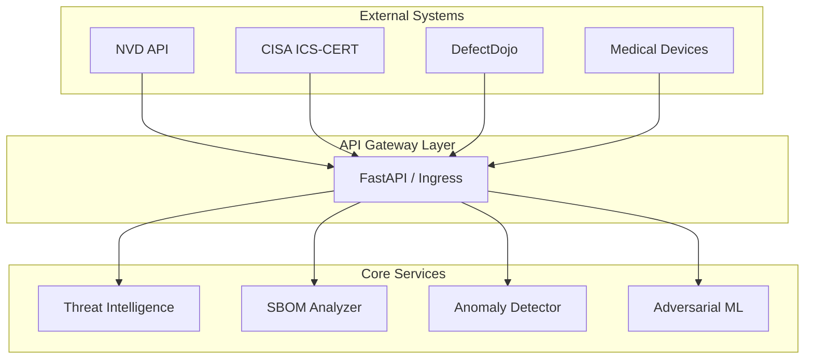

# MedTech AI Security

AI-powered cybersecurity platform for medical devices, combining NLP threat intelligence,
anomaly detection, adversarial ML testing, and graph neural networks for SBOM analysis.

## Why This Project Matters

Medical devices are increasingly connected, creating new attack surfaces that threaten
patient safety. The healthcare sector faces unique cybersecurity challenges:

- **1,250+ AI-enabled medical devices** authorized by the FDA as of 2025
- **23% increase** in healthcare intrusion frequency (CrowdStrike 2025)
- **New FDA guidance** (June 2025) requires SBOM transparency and lifecycle security
- **Emerging threats** like data poisoning and model drift can silently degrade diagnostic AI

This platform addresses these challenges with production-ready tools for threat intelligence,
anomaly detection, adversarial ML testing, and supply chain analysis.

## Platform Overview



## Modules

| Phase | Module | Description | Accuracy |
|-------|--------|-------------|----------|
| 1 | [Threat Intelligence](modules/threat-intel.md) | NVD/CISA scraping with Claude enrichment | - |
| 2 | [ML Risk Scoring](modules/risk-scoring.md) | Vulnerability risk prediction | 75% |
| 3 | [Anomaly Detection](modules/anomaly-detection.md) | DICOM/HL7 traffic analysis | 92.5% |
| 4 | [Adversarial ML](modules/adversarial.md) | FGSM/PGD/C&W attacks and defenses | - |
| 5 | [SBOM Analysis](modules/sbom-analysis.md) | GNN-based supply chain risk scoring | - |

## Quick Start

```bash
# Clone and install
git clone https://github.com/Dashtid/medtech-ai-security.git
cd medtech-ai-security
uv sync

# Run the comprehensive demo
uv run python scripts/demo_security.py
```

## Key Features

- **FDA Compliance Ready**: Designed for 510(k) and EU MDR requirements
- **Production Grade**: 672+ tests, type-checked, containerized
- **Kubernetes Native**: Helm charts and Kustomize manifests included
- **DefectDojo Integration**: Direct vulnerability management integration
- **Privacy-Preserving**: Federated learning with differential privacy

## License

MIT License - See [LICENSE](https://github.com/Dashtid/medtech-ai-security/blob/main/LICENSE) for details.
