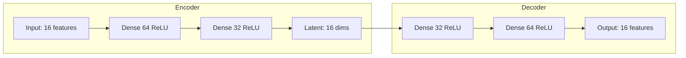

# Anomaly Detection Module

Phase 3 of the MedTech AI Security platform. Detects malicious network traffic
in DICOM and HL7 medical protocols.

## Overview

The Anomaly Detection module uses an autoencoder neural network to identify
anomalous traffic patterns in medical device networks.

## Model Architecture



## Performance

| Metric | Value |
|--------|-------|
| Accuracy | 92.5% |
| AUC-ROC | 0.86 |
| Precision | 0.91 |
| Recall | 0.93 |

## Attack Types Detected

1. Data exfiltration
2. Message injection
3. Ransomware patterns
4. DoS attacks
5. Protocol violations
6. Unauthorized access
7. Replay attacks
8. Man-in-the-middle
9. Firmware tampering
10. Credential theft

## CLI Usage

### Generate Training Data

```bash
# Generate synthetic traffic
medsec-traffic-gen --normal 1000 --attack 100 --output data/traffic.csv

# Specify attack types
medsec-traffic-gen --normal 500 --attack-types exfiltration,injection
```

### Train Detector

```bash
# Train on traffic data
medsec-anomaly train --data data/traffic.csv --model models/detector.keras

# With validation split
medsec-anomaly train --data data/traffic.csv --validation 0.2
```

### Detect Anomalies

```bash
# Analyze traffic file
medsec-anomaly detect --input new_traffic.csv --model models/detector.keras

# Real-time detection (requires root)
medsec-anomaly live --interface eth0 --port 104
```

## Python API

```python
from medtech_ai_security.anomaly import AnomalyDetector, TrafficGenerator

# Generate training data
generator = TrafficGenerator()
normal, attacks = generator.generate(normal_count=1000, attack_count=100)

# Train detector
detector = AnomalyDetector(encoding_dim=16)
detector.fit(normal)

# Detect anomalies
predictions = detector.predict(new_traffic)
anomaly_indices = predictions[predictions["is_anomaly"] == True].index
```

## Features Extracted

| Category | Features |
|----------|----------|
| Timing | Inter-arrival time, session duration |
| Network | Bytes transferred, packet counts |
| Protocol | DICOM commands, HL7 message types |
| Statistical | Entropy, variance, skewness |

## Protocol Support

### DICOM

- Standard ports: 104, 11112
- PDU parsing
- Command extraction
- AE title tracking

### HL7 v2.x

- Standard ports: 2575, 5000
- MLLP framing
- MSH segment parsing
- Message type classification

## Threshold Configuration

```python
detector = AnomalyDetector(
    encoding_dim=16,
    threshold_percentile=95,  # Reconstruction error threshold
    min_anomaly_score=0.8     # Minimum confidence for alert
)
```

## Output Format

```json
{
  "timestamp": "2025-12-13T10:30:00Z",
  "source_ip": "192.168.1.100",
  "dest_ip": "192.168.1.50",
  "protocol": "DICOM",
  "is_anomaly": true,
  "anomaly_score": 0.92,
  "reconstruction_error": 0.45,
  "attack_type": "data_exfiltration",
  "confidence": 0.87
}
```
