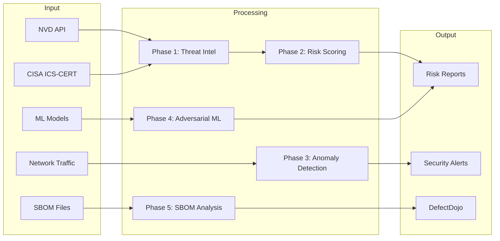

# Modules Overview

MedTech AI Security consists of five integrated modules, each addressing a specific
aspect of medical device cybersecurity.

## Architecture



## Module Summary

| Module | Purpose | Key Technology |
|--------|---------|----------------|
| [Threat Intelligence](threat-intel.md) | CVE collection and enrichment | NLP, Claude AI |
| [ML Risk Scoring](risk-scoring.md) | Vulnerability prioritization | Ensemble ML |
| [Anomaly Detection](anomaly-detection.md) | Traffic analysis | Autoencoder |
| [Adversarial ML](adversarial.md) | Model robustness testing | FGSM, PGD, C&W |
| [SBOM Analysis](sbom-analysis.md) | Supply chain risk | Graph Neural Networks |

## Integration Points

### DefectDojo

All modules can export findings to DefectDojo:

```bash
medsec-defectdojo import --findings report.json
```

### Kubernetes

Each module can be deployed as a Kubernetes service:

```bash
kubectl apply -k k8s/overlays/production/
```

### API

All modules are accessible via REST API:

```bash
# Start the API server
uvicorn medtech_ai_security.api:app --host 0.0.0.0 --port 8000
```

## Data Flow

1. **Collection**: Threat Intel gathers CVEs from NVD/CISA
2. **Enrichment**: Claude AI adds clinical context
3. **Scoring**: ML model prioritizes vulnerabilities
4. **Detection**: Anomaly detector monitors traffic
5. **Testing**: Adversarial ML validates model robustness
6. **Analysis**: SBOM analyzer assesses supply chain risk
7. **Reporting**: Results exported to DefectDojo
