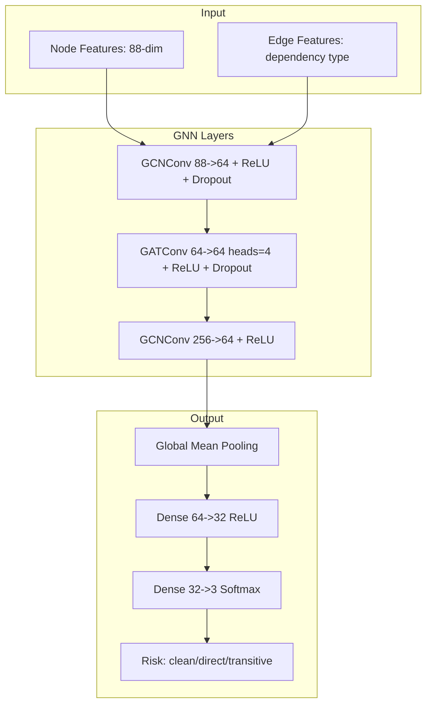

# SBOM Analysis Module

Phase 5 of the MedTech AI Security platform. Analyzes software bill of materials
using graph neural networks for supply chain risk assessment.

## Overview

The SBOM Analysis module uses Graph Neural Networks (GNN) to analyze software
dependencies and propagate vulnerability risk through the supply chain graph.

## GNN Architecture



## Supported Formats

| Format | Version | Auto-detect |
|--------|---------|-------------|
| CycloneDX | 1.4, 1.5 | Yes |
| SPDX | 2.2, 2.3 | Yes |

## Risk Factors

| Factor | Weight | Description |
|--------|--------|-------------|
| Vulnerability Score | 0.35 | Weighted by CVSS |
| License Risk | 0.15 | Copyleft, restrictive licenses |
| Dependency Depth | 0.20 | Transitive dependency distance |
| Centrality | 0.15 | Graph position importance |
| Maintenance Status | 0.15 | Last update recency |

## CLI Usage

### Analyze SBOM

```bash
# Analyze and generate report
medsec-sbom analyze --input sbom.json --output report.html

# JSON output
medsec-sbom analyze --input sbom.json --format json

# With vulnerability database update
medsec-sbom analyze --input sbom.json --update-db
```

### Generate Demo SBOM

```bash
# Run demo with sample SBOM
medsec-sbom demo --html

# Generate sample SBOM
medsec-sbom generate --packages 50 --output sample_sbom.json
```

### Export to DefectDojo

```bash
medsec-sbom analyze --input sbom.json --defectdojo --product "My Device"
```

## Python API

```python
from medtech_ai_security.sbom_analyzer import (
    SBOMAnalyzer,
    SBOMParser,
    DependencyGraphBuilder,
    VulnerabilityGNN,
    RiskScorer
)

# Parse SBOM
parser = SBOMParser()
sbom = parser.parse("sbom.json")

# Build dependency graph
builder = DependencyGraphBuilder()
graph = builder.build(sbom)

# Analyze with GNN
gnn = VulnerabilityGNN.load("models/sbom_gnn.pt")
risk_scores = gnn.predict(graph)

# Generate report
analyzer = SBOMAnalyzer()
report = analyzer.analyze("sbom.json")
print(f"Overall Risk: {report.risk_score}")
print(f"Critical Components: {report.critical_count}")
```

## FDA Compliance Features

### SBOM Requirements (per FDA 2025 Guidance)

- Component enumeration (name, version, supplier)
- Vulnerability disclosure tracking
- License compliance verification
- Transitive dependency analysis

### 510(k) Export

```bash
medsec-sbom analyze --input sbom.json --fda-format --output fda_submission.pdf
```

## Output Report

```json
{
  "sbom_file": "device_sbom.json",
  "analysis_date": "2025-12-13",
  "total_components": 156,
  "risk_summary": {
    "overall_score": 7.2,
    "risk_level": "high",
    "critical_vulns": 3,
    "high_vulns": 12,
    "medium_vulns": 45
  },
  "top_risks": [
    {
      "component": "openssl",
      "version": "1.1.1",
      "risk_score": 9.1,
      "cves": ["CVE-2025-1234"],
      "recommendation": "Upgrade to 3.0.x"
    }
  ],
  "license_issues": [
    {
      "component": "gpl-library",
      "license": "GPL-3.0",
      "issue": "Copyleft may require source disclosure"
    }
  ],
  "dependency_graph": {
    "nodes": 156,
    "edges": 423,
    "max_depth": 8,
    "most_central": "requests"
  }
}
```

## Graph Visualization

The module can generate interactive dependency graphs:

```bash
medsec-sbom visualize --input sbom.json --output graph.html
```

This creates an interactive HTML visualization showing:

- Component nodes (sized by risk)
- Dependency edges (colored by type)
- Vulnerability overlays
- Click-to-expand details
